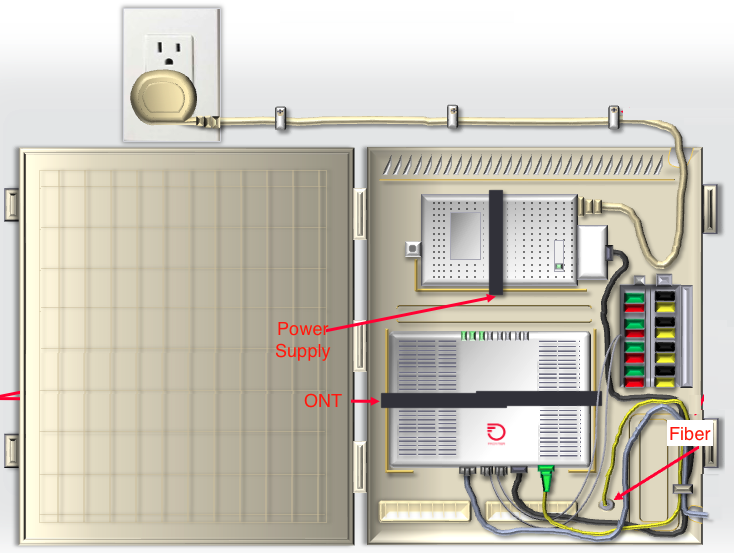

# Improving the Outdoor Enclosure
## Overview
To provide fiber Internet service, Frontier must place equipment at your home. This requires several pieces of equipment:
- An enclosure (typically made of plastic) that has multiple locations to mount the ONT, power supply, and carefully route cables
- An ONT which is an electronic device that converts optical signals into electrical signals (Ethernet, WiFi, Coaxial cable, etc.)
- A power supply
- Various cables connecting the equipment to our network and to your home

  
Enclosures (and the equipment inside them) are made to undergo significant stress and environmental factors. This includes:
- Direct sunlight (UV and non-UV radiation)
- High ambient temperatures (up to 140°F)
- Low ambient temperatures (down to -40°F)
- Significant temperature swings (from morning to evening)
- Rain, snow, sleet, hail, fog
- Rodents and insects
- Physical damage (gardeners, construction, etc.)

## Problem Statement
Your challenge is to improve in any way you can the enclosure that houses our equipment but with special attention to reducing the internal temperature. This improves the longevity of the equipment inside and ensure our service keeps working even in hot Texas summers!

## Materials Explanation
The first 10 teams will be given a physical kit consisting of:
- An real-world sample of our existing enclosure
- An ONT
- A power supply
- Several cables

We also provide CAD files in several formats [here](./Drawings/) if you need them or prefer to do your design in software rather than hardware

>These materials are yours to do with as you please but be aware that the electronics must be in their original working condition during judging! You are free, however to make destructive modifications or additions to the enclosure

## Things you can do
- Modify the enclosure in some physical way to improve heat disipation by adding different materials
- Change the physical shape or charachteristics of the enclosure (you don't have to use ours, you can build your own!)
- Add any kind of sensor or mechanical device (but remember the enclosure has no power source of its own)
- Paint the enclosure with any material
- Make the enclosure more asthetically pleasing
- Modify the way cables route or the electronics/power supply are placed (as long as you don't do the stuff below)

## Things you shouldn't do
- Modify the electronics or power supply physically or their software
- Bend or break fibers or other cables (fibers can't have more than a 60° bend)

## Judging
1. The primary goal is to reduce the internal temperature of the enclosure when it is exposed to a light source (such as the sun, a heat lamp, an incandecent bulb, etc.). This will be judged by ~exposing the enclosure to a heat source for 10 minutes and measuring the internal temperature vs. the ambient temperature~ using FLIR to visualize the temperature of the box vs. ambient.
  Alternately, you may use modeling software to simulate a heat source if you choose to do the challenge virtually.
1. A secondary goal is to improve the enclosure in **_any other way you can imagine!_**
